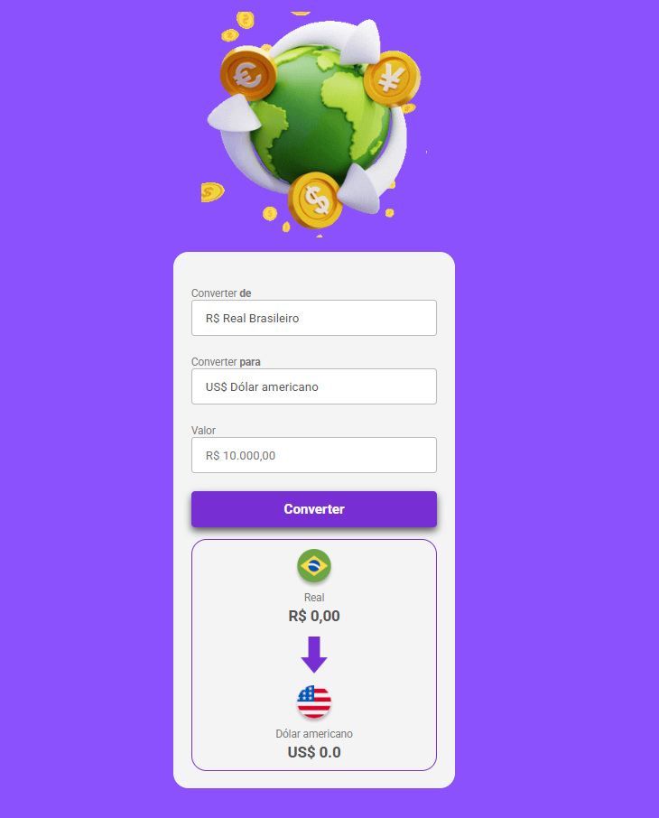

<h1 align="center">💱 Conversor de Moedas</h1>

  Um projeto simples e funcional de conversão de moedas, desenvolvido para praticar JavaScript na prática.

  
  
  

<h2>🚀 Sobre o Projeto</h2>

Este projeto é um conversor de moedas que permite transformar valores entre diferentes moedas de forma rápida e prática.
Foi desenvolvido como meu primeiro contato real com JavaScript, focando em manipulação do DOM e lógica de programação.

<ul>
  <li>💰 Conversão entre moedas</li>
  <li>⚡ Interface simples e rápida</li>
  <li>🎨 Design baseado em protótipo do Figma</li>
</ul>

<h2>🛠️ Tecnologias Utilizadas</h2>

<ul>
  <li>HTML5</li>
  <li>CSS3</li>
  <li>JavaScript (Vanilla)</li>
  <li>Figma (para design e layout)</li>
</ul>

<h2>📦 Como Rodar o Projeto</h2>

<pre>
# Clone o repositório
git clone https://github.com/seu-usuario/seu-repo.git

# Acesse a pasta
cd seu-repo

# Abra o index.html no navegador
</pre>

<h2>📸 Preview</h2>

  

<h2>📚 Aprendizados</h2>

Durante esse projeto, aprendi:

<ul>
  <li>Manipulação do DOM com JavaScript</li>
  <li>Eventos e interações com o usuário</li>
  <li>Organização de código front-end</li>
</ul>

<h2>📌 Status</h2>

🚧 Projeto Finalizado

<h2>👨‍💻 Autor</h2>

Desenvolvido por você 🚀

